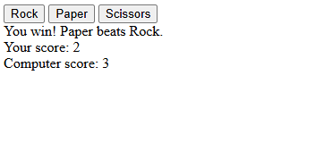

# Rock Paper Scissors

A simple game of Rock, Paper, Scissors with selectable buttons.

Built as part of [The Odin Project](https://www.theodinproject.com/) curriculum to practice **Javascript**, mainly with **query selectors** and **event listeners**.

## Features

- Basic computer AI that plays against you
- Score system for you and the computer

## Demo

### [Live Demo](https://songzhang015.github.io/project-3-rock-paper-scissors/)

## Built Using

- HTML
- Javascript
